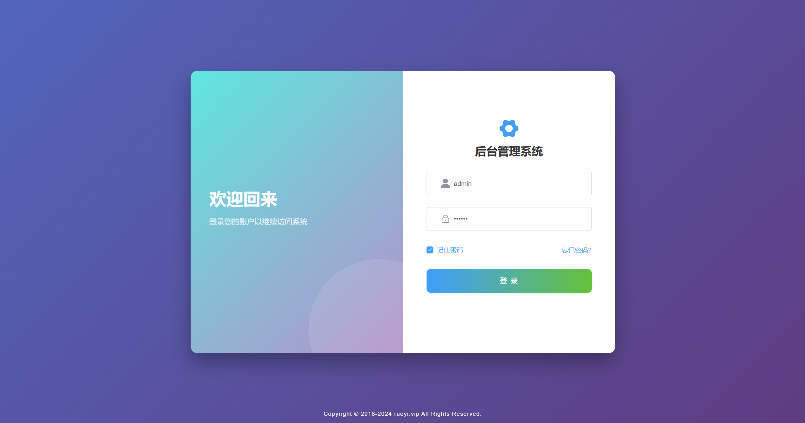
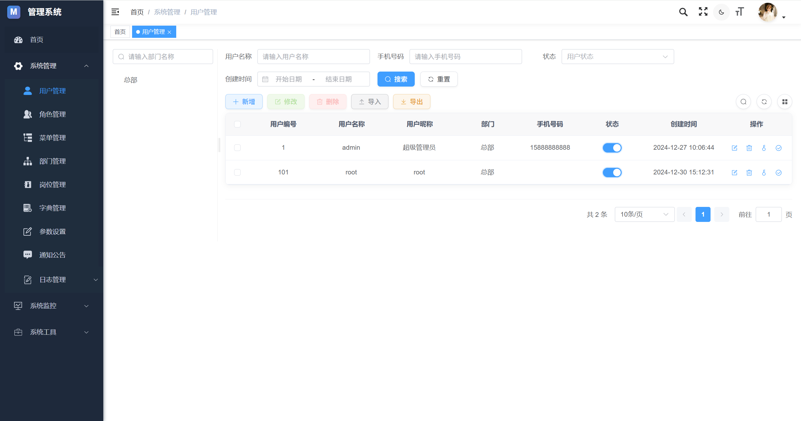
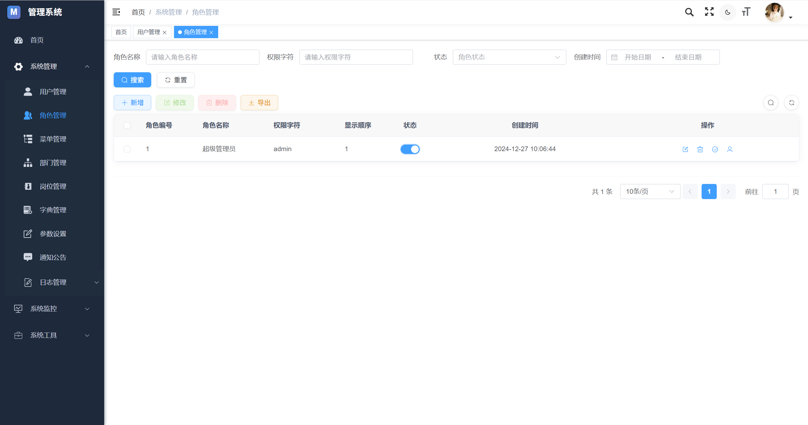
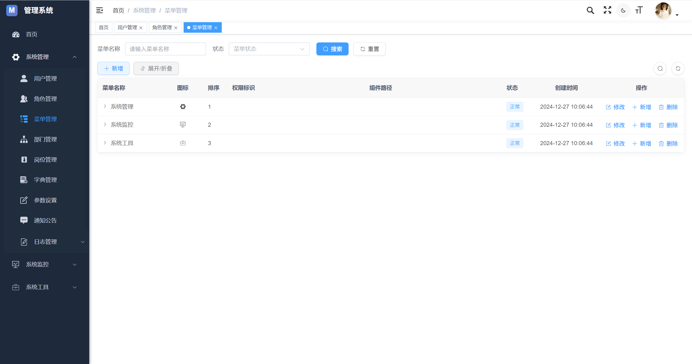
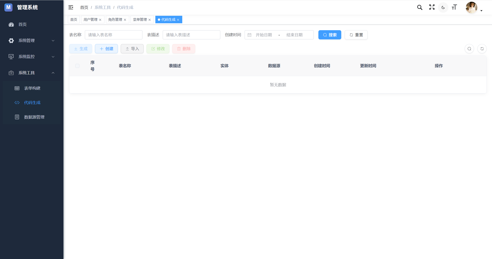
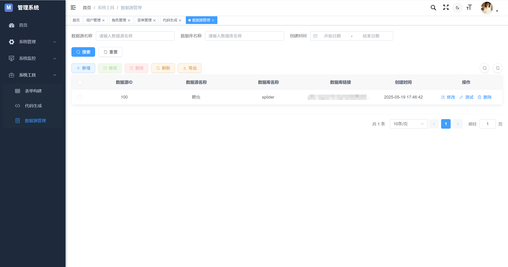

# RuoYi-Magic 管理系统

> 本项目是基于 RuoYi 的二次开发项目，集成了多项增强功能和技术升级。

## 项目介绍

RuoYi-Magic 是一个基于 RuoYi 框架二次开发的企业级管理系统，采用前后端分离架构，集成了多项技术升级和功能增强。项目使用 Spring Boot 3.x、MyBatis-Flex、Sa-Token 等现代化技术栈，提供了更高效、更安全、更灵活的开发体验。

## 技术栈

### 后端技术

- **核心框架**：Spring Boot 3.2.2
- **安全框架**：Sa-Token 1.42.0
- **持久层框架**：MyBatis-Flex 1.10.9
<<<<<<< HEAD
<<<<<<< HEAD
- **数据库连接池**：HikariCP
=======
- **数据库连接池**：Druid 1.2.24
>>>>>>> 2fe1861 (first commit)
=======
- **数据库连接池**：HikariCP
>>>>>>> af4fee7 (refactor(系统优化): 重构数据库连接池为HikariCP并优化启动性能)
- **缓存框架**：Redis
- **日志管理**：SLF4J + Logback
- **工具类库**：Hutool 5.8.26、Apache Commons
- **接口文档**：Knife4j (Swagger3)
- **AI 集成**：Spring AI Alibaba

### 前端技术

- **核心框架**：Vue.js
- **UI 框架**：Element Plus
- **状态管理**：Vuex
- **路由管理**：Vue Router
- **HTTP 客户端**：Axios

## 功能特性

- **用户权限管理**：基于 Sa-Token 的用户认证和权限控制
- **数据权限控制**：支持多维度的数据权限控制
- **代码生成**：支持自定义模板的代码生成功能
- **多数据源管理**：支持多数据源配置和动态切换
- **定时任务**：基于 Quartz 的定时任务调度管理
<<<<<<< HEAD
<<<<<<< HEAD
- **系统监控**：服务器、Redis 监控
=======
- **系统监控**：服务器、Redis、Druid 监控
>>>>>>> 2fe1861 (first commit)
=======
- **系统监控**：服务器、Redis 监控
>>>>>>> af4fee7 (refactor(系统优化): 重构数据库连接池为HikariCP并优化启动性能)
- **操作日志**：详细记录用户操作日志
- **数据字典**：支持多级数据字典管理
- **MyBatis-Flex 增强**：使用 MyBatis-Flex 提供的监听器、查询构建器等特性
- **AI 能力集成**：集成 Spring AI Alibaba 提供智能化功能

## 项目结构

```
├── src
│   ├── main
│   │   ├── java
│   │   │   └── com.ruoyi
│   │   │       ├── common          // 公共模块
│   │   │       ├── framework       // 核心框架
│   │   │       ├── system          // 系统模块
│   │   │       ├── quartz          // 定时任务
│   │   │       ├── generator       // 代码生成
│   │   │       └── RuoYiApplication.java  // 启动类
│   │   └── resources
│   │       ├── static             // 静态资源
│   │       ├── templates          // 模板文件
│   │       └── application.yml    // 配置文件
├── doc                            // 文档
├── sql                            // 数据库脚本
└── pom.xml                        // Maven 依赖
```

## 安装部署

### 环境要求

- JDK 17+
- MySQL 8.0+
- Redis 6.0+
- Maven 3.8+

### 部署步骤

1. **准备数据库**
   - 创建数据库 `ry-vue`
   - 执行 `sql/ry-vue.sql` 脚本

2. **修改配置**
   - 修改 `application.yml` 中的数据库连接信息
   - 修改 Redis 配置

3. **编译打包**
   ```bash
   mvn clean package -DskipTests
   ```

4. **运行项目**
   ```bash
   java -jar ruoyi.jar
   ```

## 系统截图

### 登录页面



### 用户管理



### 角色管理



### 菜单管理



### 代码生成



### 数据源管理



## 特别说明

本项目基于 RuoYi 进行二次开发，在保留原有功能的基础上进行了技术升级和功能增强：

1. 升级到 Spring Boot 3.x
2. 替换 MyBatis 为 MyBatis-Flex
3. 替换 Shiro 为 Sa-Token
4. 集成 Spring AI Alibaba
5. 优化代码生成功能
6. 增强数据源管理能力

## 开发规范

项目遵循 MyBatis-Flex 开发规范

## 许可证

[MIT License](LICENSE)